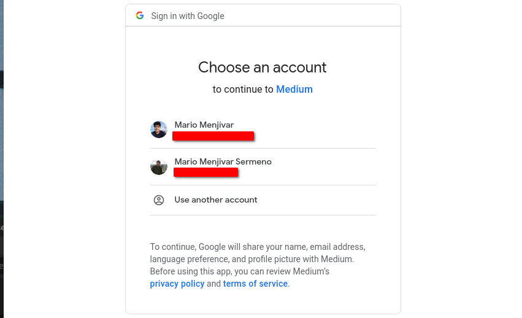

import Tabs from '@theme/Tabs';
import TabItem from '@theme/TabItem';

Antes de comenzar debemos hacer una distinción muy importante. Autenticar y autorizar son dos aspectos completamente independientes pero centrales a la seguridad. Auténticar se refiere a confirmar que los usuarios son quienes dicen ser. Autorizar, por otro lado, es dar acceso a los recursos a esos usuarios.

En esta entrada, hablaremos de quizá la más prominente implementación de los protocolos OpenID Connect y OAuth 2.0 para NETCore: Identity Server 4. En específico cómo proteger tus APIs con en Node.js.

<!--truncate-->

## OAuth 2.0 + OpenID

Lo más seguro es que en algún momento hayas visto una página como esta:



Este es un ejemplo de una implementación de OAuth y OpenID que tiene como objetivo permitir que Medium pueda utilizar tu cuenta de Google para loguearte. Sin embargo, para lograrlo, Medium debe pedirte permiso para acceder _a ciertos datos_ de tu perfil de Google con los cuáles puede identificar tu cuenta.

OAuth 2.0 y OpenID conforman el estándar de la industria para llevar a cabo este importante proceso de auténticar y autorizar usuarios. Más que aplicaciones o servicios que puedan ser instalados, ambos son estándares abiertos de autorización y autenticación que pueden ser implementados por cualquiera.

### Client Credentials

OAuth 2.0 + OpenID nos permite cubrir distintos escenarios de autorización. Estos son conocidas como _Flows_ y son las formas en las que OAuth 2.0 puede proveer un _token_. Por ejemplo, una aplicación pidiendo al usuario confirmación para accesar cierta información, como en la imagen.

En este post, nos enfocaremos en una: _Client Credentials_.

También conocida como autorización server a server, este _Flow_ nos permite autorizar y auténticar un App (mejor conocido como _Client_) en lugar de a un usuario. Para conseguirlo, cada App (o _Client_) utiliza un _Client ID_ y un _Client Secret_ para auténticarse con el servidor y obtener un _Token_.

## Identity Server 4

_In a nutshell_, Identity Server 4 es un framework de OAuth 2.0 y OpenID para ASP.NET Core. Está certificado por la [OpenID Foundation](https://openid.net/). Es quizá la más prominente implementación de OAuth 2.0 y OpenID para .NET Core, permite las siguientes features:

- Autenticación como servicio
- Single Sign-on/Sign-out
- Control de acceso para APIs
- Federation Gateaway
- Enfoque en personalización
- Código abierto maduro
- Soporte comercial y gratuito

Puedes ver un demo online ahora mismo en [identity.mariomenjr.com](https://identity.mariomenjr.com).

Para empezar a trabajar con este framework, primero debemos instalarlo. Con .NET Core, esto se 
puede realizar con Visual Studio o el comando **dotnet** en la terminal.

### Instalación

Una forma fácil de empezar es instalando localmente las distintas templates provista por Identity Server:

<!-- TODO: Include Tab for Visual Studio -->

<Tabs
  groupId="operating-systems"
  defaultValue="cli"
  values={[
    {label: 'dotnet CLI', value: 'cli'},
  ]
}>
<TabItem value="cli">

```bash 
dotnet new -i IdentityServer4.Templates
```

</TabItem>
</Tabs>


## Cuándo + Porqué

En un mundo dónde existen Amazon Cognito, Okta, Google Cloud Identity, entre otros, ¿Por qué implementaría un Identity Server por mi cuenta?

## Identity Server 4 License

## Conclusión

## Referencias

- [Authentication vs. Authorization](https://www.okta.com/identity-101/authentication-vs-authorization/)
- [What is OAuth 2.0?](https://auth0.com/intro-to-iam/what-is-oauth-2/)
- [Authentication and Authorization Flows](https://auth0.com/docs/flows)
- [Identity Server 4: The Big Picture](https://identityserver4.readthedocs.io/en/latest/intro/big_picture.html)